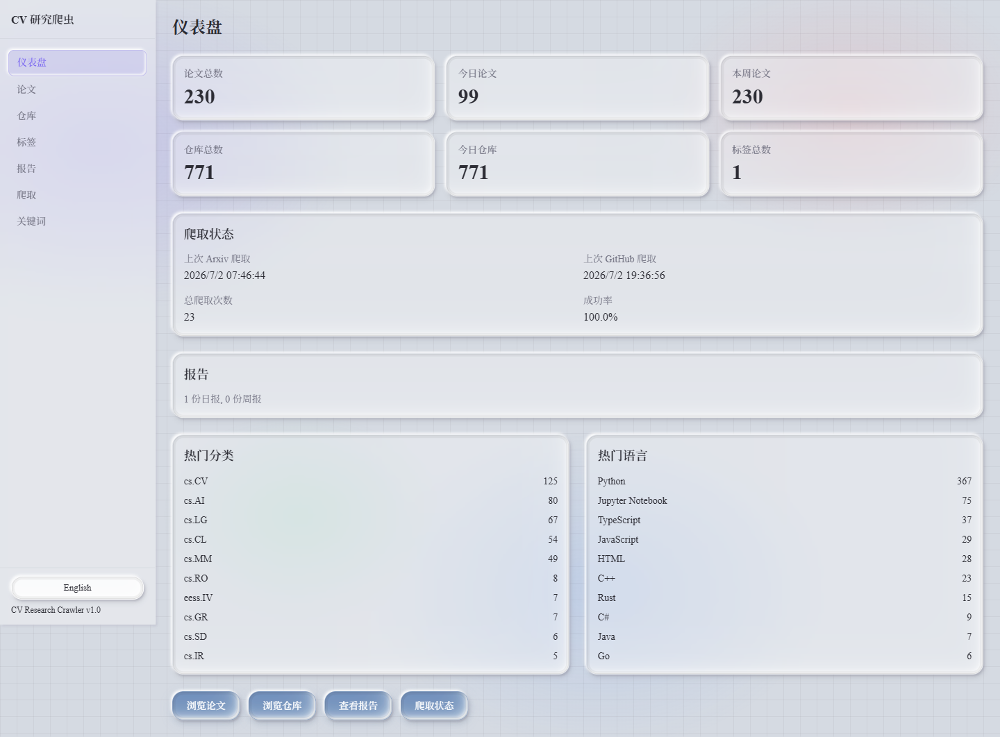
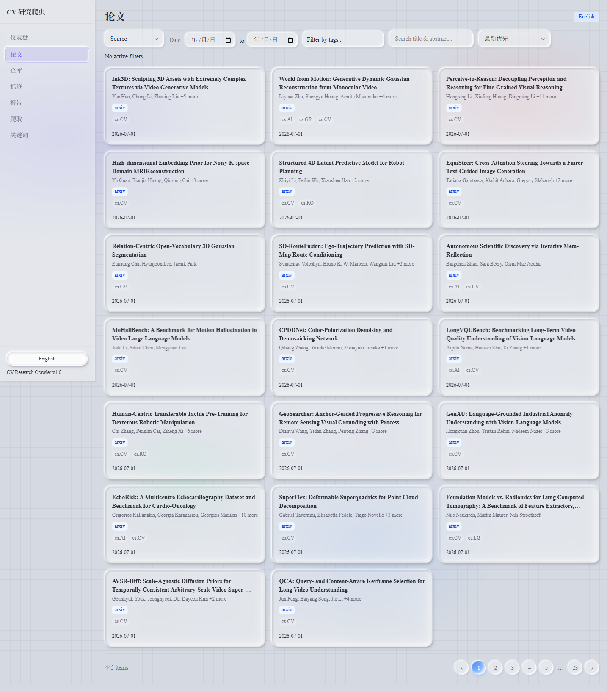
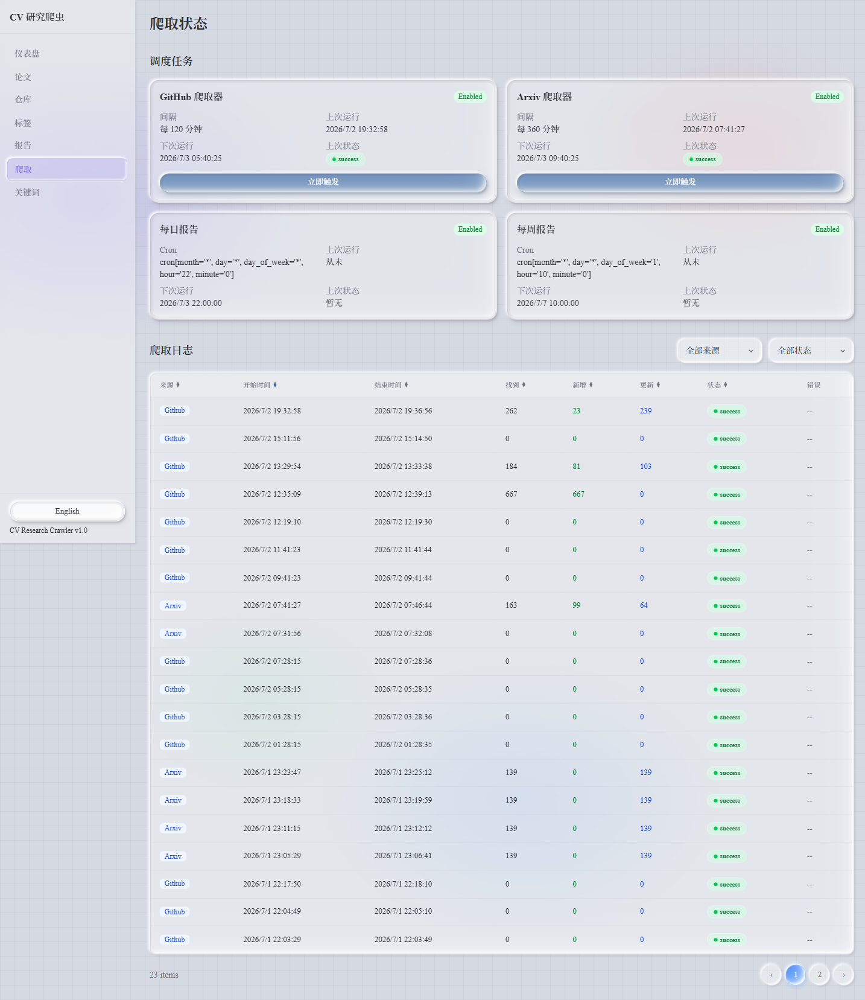
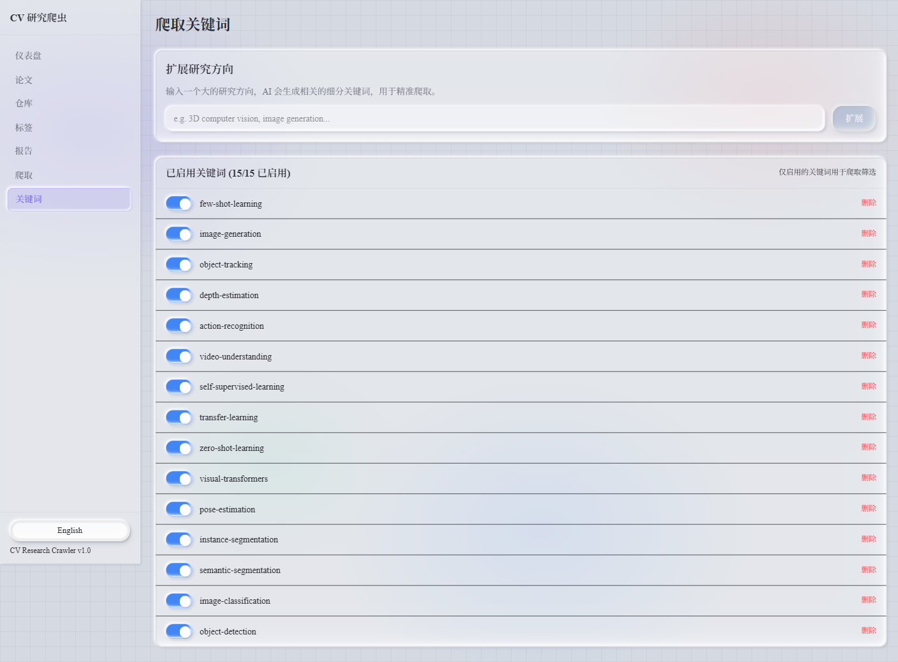

# CV Research Crawler

AI-powered knowledge crawler for Computer Vision research papers and GitHub repositories, with dual-language UI and LLM-generated summaries.

## Features

- **Automated Crawling** — Fetches papers from arxiv (cs.CV, cs.AI, cs.LG, cs.MM, cs.CL) and GitHub repos across 9 CV topics
- **AI Summaries** — Local LLM (Ollama) generates Chinese + English summaries for every paper and repository
- **Keyword Expansion** — Input a broad research direction, AI generates specific sub-topic keywords for precise filtering
- **Smart Filtering** — Only crawl content matching your selected keywords; toggle keywords on/off anytime
- **Dual Language** — Full Chinese/English UI with one-click toggle; all interface text switches languages
- **Scheduled Reports** — Auto-generated daily (22:00) and weekly (Mon 10:00) Markdown digests
- **Tag Management** — Create custom colored tags, assign to papers/repos, filter by tags
- **Neo-Glass UI** — Glassmorphism + neumorphism hybrid design system (light theme)

## Screenshots

### Dashboard


### Papers Browser


### Crawl Status & Scheduler


### Keyword Management


## Tech Stack

| Layer | Technology |
|-------|-----------|
| Backend | Python 3.12+, FastAPI, SQLAlchemy 2.0, APScheduler |
| Frontend | React 18, TypeScript, Tailwind CSS 4, Vite 6 |
| Database | SQLite (WAL mode, default) / PostgreSQL (optional) |
| AI/LLM | Ollama (local), OpenAI-compatible API support |
| Reports | Jinja2 templates → Markdown files |
| Container | Docker Compose (single-stack deployment) |

## Quick Start

### Prerequisites

- Python 3.12+
- Node.js 18+
- [Ollama](https://ollama.com) (optional, for AI summaries)

### 1. Setup

```bash
git clone https://github.com/chenacc1/cv-research-crawler.git
cd cv-research-crawler
```

### 2. Backend

```bash
cd backend
cp .env.example .env          # Edit .env to configure
pip install -r requirements.txt
python -m uvicorn app.main:app --host 0.0.0.0 --port 8000 --reload
```

### 3. Frontend

```bash
cd frontend
npm install
npm run dev
```

Open http://localhost:5173

### 4. Configure Ollama (optional)

```bash
ollama pull gemma4:e4b    # or any model you prefer
```

Edit `backend/.env`:
```
LLM_API_BASE=http://localhost:11434
LLM_MODEL=gemma4:e4b
LLM_SUMMARY_ENABLED=true
```

## Project Structure

```
├── backend/
│   ├── app/
│   │   ├── crawlers/      # Arxiv & GitHub crawler plugins
│   │   ├── engine/        # APScheduler + report generator
│   │   ├── models/        # SQLAlchemy ORM models
│   │   ├── routers/       # FastAPI route handlers
│   │   ├── schemas/       # Pydantic request/response
│   │   └── services/      # Business logic + LLM service
│   └── requirements.txt
├── frontend/
│   └── src/
│       ├── components/    # Reusable UI (glass design system)
│       ├── hooks/         # Custom React hooks
│       ├── i18n/          # Chinese/English translations
│       ├── pages/         # Page components
│       └── types/         # TypeScript interfaces
├── docs/
│   ├── requirements.md    # Product requirements
│   ├── architecture.md    # Technical architecture
│   └── api-contract.md    # REST API specification
├── docker-compose.yml     # One-command deployment
└── .env.example           # Configuration template
```

## API Endpoints

| Method | Path | Description |
|--------|------|-------------|
| GET | `/api/v1/papers` | List papers (filter, search, paginate) |
| GET | `/api/v1/papers/{id}` | Paper detail |
| GET | `/api/v1/repos` | List repos |
| GET | `/api/v1/tags` | List/manage tags |
| GET | `/api/v1/reports` | Browse generated reports |
| GET | `/api/v1/crawls/status` | Scheduler job status |
| POST | `/api/v1/crawls/trigger/{source}` | Manual crawl trigger |
| POST | `/api/v1/crawl-keywords/expand` | LLM keyword expansion |
| GET | `/api/v1/stats` | Dashboard statistics |

Full OpenAPI docs at http://localhost:8000/docs

## Docker Deployment

```bash
docker compose -p cv-crawler up -d
# Backend: :8000  Frontend: :3000
```

## Configuration

All settings via environment variables in `.env`:

| Variable | Default | Description |
|----------|---------|-------------|
| `DATABASE_URL` | `sqlite+aiosqlite:///./data/app.db` | Database connection |
| `GITHUB_TOKEN` | — | GitHub API token (optional) |
| `CRAWLER_ARXIV_INTERVAL_MINUTES` | `360` | Arxiv crawl interval |
| `CRAWLER_GITHUB_INTERVAL_MINUTES` | `120` | GitHub crawl interval |
| `LLM_API_BASE` | `http://localhost:11434` | Ollama/OpenAI API URL |
| `LLM_MODEL` | `gemma4:e4b` | LLM model name |
| `CRAWLER_KEYWORDS` | — | Comma-separated fallback keywords |
| `REPORT_DAILY_CRON` | `0 22 * * *` | Daily report schedule |
| `REPORT_WEEKLY_CRON` | `0 10 * * 1` | Weekly report schedule |

## License

MIT
